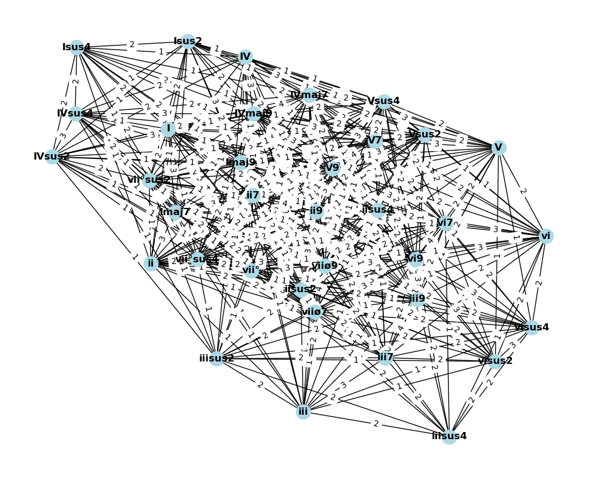

automusic is a Python project for the algorithmic generation of music. Built using principles of graph theory, automusic
can generate random chord progressions.

The user can designate a starting key, a mode, and sets of diatonic chords in that mode to use in the random walk.
automusic will provide both string descriptions of the chords (currently slightly inaccurate as these are based on the 
relative Ionian mode as far as the Roman numerals are concerned) and a numeric list of the notes in the chord, with C as 
the 0 index. This is designed for quick conversion to MIDI in the near future.

Future development plans include allowing the generation of MIDI files from the chord progressions, rhythmic variations,
integrating the rules of counterpoint to create melodies, key changes, and using chord change probabilities derived from
popular music rather than simply manipulating chord change probabilities based on number of shared notes.